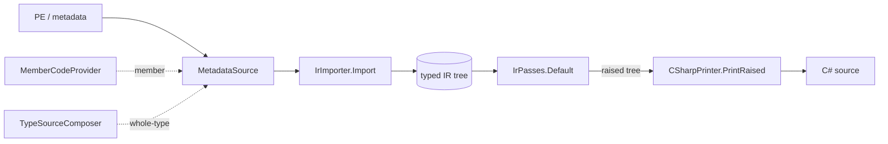

# Decompiler Design

This document describes the architecture of `ILInspector.Decompiler` — *how the pipeline decides* its output. Three companion docs cover the rest: [decompiler-ir.md](decompiler-ir.md) is the focused reference for the IR and importer contracts this doc builds on, [decompiler-taste.md](decompiler-taste.md) governs *what* the decompiler renders, and [decompiler-quality.md](decompiler-quality.md) is *how we know the output is right*.

## Design goal: recognizability

This tool is expected to transition to the dotnet org and be maintained by engineers who work on Roslyn, RyuJIT, and related compilers. The overriding architectural goal is that those engineers open this codebase and find the shape they already know — and want to improve it rather than rewrite it.

That shape is the standard compiler pipeline, which Roslyn, RyuJIT, and ILSpy arrived at independently:

1. A **typed IR** with parent/child structure.
2. An **ordered list of named passes**, each doing one job.
3. **Invariant validation after every pass** (debug builds).
4. **All decisions made in the tree before output** — printing is a dumb final stage.

Decompilation is this pipeline run in reverse. Where Roslyn *lowers* C# constructs to IL through named rewriters, we *raise* IL back through the inverse transforms. This duality is load-bearing: Roslyn's `Lowering/` directory is our completeness checklist, and each of our raising passes should be named and documented as the inverse of the Roslyn rewriter whose output it recognizes.

## Rosetta stone

| Concept | This codebase | Roslyn | RyuJIT | ILSpy |
| --- | --- | --- | --- | --- |
| Typed IR | `IrNode` tree | `BoundNode` tree | `GenTree` | `ILInstruction` |
| Pass list | `IrPasses.Default` | `LocalRewriter` + dedicated rewriters | phase table | `CSharpDecompiler.GetILTransforms()` (27 passes) |
| Sugar handling | raising passes (inverse of lowering) | lowering rewriters (`Lowering/`) | — | `LockTransform`, `UsingTransform`, `SwitchOnStringTransform`, … |
| State machines | raising passes (PDB-first) | `AsyncRewriter` / `IteratorRewriter` | — | `AsyncAwaitDecompiler` / `YieldReturnDecompiler` (passes 7–8) |
| Per-pass validation | `IrFunction.CheckInvariant` (debug) | `Debug.Assert` culture | asserts between phases | `ILInstruction.CheckInvariant(ILPhase)` |
| Verification | `--gaps` / `--fidelity-check` / `--validity-check` | — | jitutils `asmdiffs` / SuperPMI | — |
| Pipeline visibility | `--dump` (per-pass IR projection) | — | `JitDump` | DebugSteps UI |
| Output stage | `CSharpPrinter` (decides in the tree, prints last) | emit phase | codegen | `StatementBuilder` → `CSharpOutputVisitor` |
| Naming | PDB-scope-aware local names | — | — | `AssignVariableNames` (final pass, scope-aware) |

## Architecture

| Stage | Role |
| --- | --- |
| `MetadataSource` | PE + metadata + optional PDB lifetime; SRM-only ([decompiler-ir.md](decompiler-ir.md) defines the contract) |
| `IrImporter.Import` | raw IL → typed IR tree, with symbolic type identity (`TypeRef`) |
| `IrPasses.Default` | ordered raising passes — one named class, one job; `CheckInvariant` after each in debug builds |
| `CSharpPrinter.PrintRaised` | runs the passes, then prints the raised tree; taste-doc spelling policy lives here |

The IR and importer contracts are specified in [decompiler-ir.md](decompiler-ir.md); this doc treats them as given and describes how the stages compose. The product reaches the pipeline through `MemberCodeProvider` (member level) and `TypeSourceComposer` (whole-type). `IrImporter.Import` and `CSharpPrinter.PrintRaised` are both exception-safe by construction: a one-method bug surfaces as a diagnostic comment and a lowered fidelity level, never a crash or silently-wrong output (see [decompiler-quality.md](decompiler-quality.md) for what that floor guarantees).

Key properties:

- **The statement tree is the library's product, not the string.** Alternate front ends (IDE hovers, web viewers, diff tools) consume the tree and apply their own formatting and spans; our printer is merely the first front end. Taste splits across two homes: **raising policy** — which patterns the passes recover (`lock`, `using`, switch expressions vs. goto; the taste doc's three-class rule) — lives in the pipeline and shapes the tree itself, while **spelling policy** (qualification, parenthesization, formatting) lives in the printer and is the part alternate front ends may replace.
- **Whole-type composition lives in the library.** `TypeSourceComposer` (in `ILInspector.Decompiler`) gives any front end per-type listings, using-hoisting, and forwarder-following without rebuilding them.
- **Naming is a final pass over fully-determined scopes**, as in ILSpy's `AssignVariableNames`. PDB local scopes are its natural input. The two remaining corpus gaps (synthesized names for `S_N`/`V_N`, multi-scope declaration placement) are this pass, not emitter features.
- **Every stage boundary is a projectable IR.** The default projection is the typed IR tree (`IrPrinter`); the annotated-IL import views (raw/typed/structured, from `IlProjection`) prepend as an opt-in (`--il`). The inspection and verification modes this capture powers are described under *Inspection and verification* below.
- **Results carry diagnostics, with concrete fidelity levels.** The library returns a result with output, diagnostics, and a fidelity level — never a silent `catch { }` in the library or its hosts. The levels are ordered and concrete, because the product routes on them: `Full` (every construct raised; representable C#), `Partial` (C# containing explicit unrepresentable nodes), `StructuredOnly` (structured control flow over low-level expressions), `IlOnly` (no C# rendering; IL projections still available), `Failed`. IL that has no C# spelling is modeled explicitly in the tree, not forced into plausible text — output degrades honestly, with the reason attached.
- **Diagnostics get stable IDs from the first PR.** They drive fallback routing and CI triage, so they are machine-readable Roslyn-style identifiers (`DEC0001`-form) with the prose message alongside — never bare strings.
- **Type identity is symbolic inside the pipeline.** Handles and signatures (byref, pinned, generic, function pointer, token identity) stay typed (`TypeRef`) through the tree; strings appear only at the printer.
- **Cross-assembly facts resolve through one seam.** The importer is single-assembly, so a bare token (a `newobj` target) carries no value-type byte for a type defined elsewhere. `CrossAssemblyTypeResolver` recovers such facts on demand — locate the defining assembly via an injected `AssemblyLocator`, follow forwarders (`TypeForwardResolver`), walk the base chain — and stamps the answer onto the `TypeRef` at import so every consumer (the allocation classifier today) reads it for free. The library ships a "next-by" sibling locator; the product injects a platform/package-aware one. A reference whose public-key token is a trusted platform key (`PlatformKeys`) is asserted `AssemblyTrust.Platform` and resolved only from the trusted framework — both a confusion guard (a planted local copy cannot impersonate a platform type) and a fast path. Resolution is precision-preserving: unreachable types stay unknown, never guessed.
- **State machines are pass-layer work.** Both Roslyn (dedicated rewriters) and ILSpy (dedicated early transforms) treat async/iterators that way, and they land here as dedicated raising passes, PDB-first against state-machine debug info with shape-based recovery as a lower-priority fallback.

## What we deliberately do differently

Two divergences from ILSpy are intentional and argued in [decompiler-taste.md](decompiler-taste.md):

- **Honest output over aggressive canonicalization.** Where Debug and Release builds produce different IL, we preserve the difference rather than normalizing to one rendering. The canonicalization dial is set weaker than ILSpy's on purpose: this is an inspection tool, and the IL is the ground truth.
- **Zero runtime dependencies.** The library depends only on `System.Reflection.Metadata` (via `ILInspector.Metadata`). We borrow the architecture of our neighbors, not their packages — no Roslyn syntax trees, no NRefactory-derived AST. The statement tree is small (roughly a dozen node kinds) and hand-written; ILSpy's generated 60 KB instruction set solves a scale problem we do not have.
- **Dataflow facts proportionate to the rewrites we do.** Cross-block transforms get only the facts they need (the definite-assignment CFG dataflow behind `--facts`, for instance). We deliberately stop short of SSA and value numbering: ILSpy ships a complete decompiler without them, and a JIT-grade dataflow stack would be infrastructure without a customer here.

## Unsafe contexts under the updated memory-safety rules

A module compiled with the `updated-memory-safety-rules` feature carries a
module-level `MemorySafetyRulesAttribute`. Under those rules the member `unsafe`
modifier no longer makes a method body an unsafe context, so `CSharpPrinter`
emits explicit, minimally scoped `unsafe { }` blocks around the operations that
still need one. For a legacy module (no attribute) it emits no blocks — the
member modifier supplies the context. The wrapping is gated on the source
module's rules, so legacy output is byte-identical.

An operation needs a block when it is:

- a pointer dereference (`*p`) or a function-pointer invocation (`calli`);
- a call to a *requires-unsafe* member — one stamped with `RequiresUnsafeAttribute`
  (`System.Diagnostics.CodeAnalysis`), i.e. declared `unsafe`/`extern`, even with
  no pointer in the call;
- a call whose callee has a pointer or function-pointer anywhere in its signature
  (the spec's compat fallback for cross-assembly callees whose attributes can't be
  read, e.g. `NativeMemory.Free(void*)`);
- a `stackalloc` converted to a `Span<T>`/`ReadOnlySpan<T>` with no initializer in
  a `[SkipLocalsInit]` body (the stack space is uninitialized).

Taking an address (`&x`), declaring pointer locals, the `fixed` statement, and
`sizeof` are safe under the new rules and stay outside the blocks. When the unsafe
operation initializes a local used later, the declaration is hoisted above the
block so the variable stays in scope.

The stackalloc→`Span<T>` case is first raised from the compiler's lowering — a
`localloc` fed to the `Span<T>(void*, int)` constructor — back into a source-level
`stackalloc T[n]` by `StackAllocSpanPass`. That raise is mode-independent
correctness (the lowered ctor shape `new Span<T>(stackalloc byte[...], n)` never
compiles, in any module); only the `unsafe` wrapping above is gated on the rules.
The hoisted declaration omits `scoped` — a `scoped` local leaves no IL trace and so
cannot be recovered (it may produce a CS9081 *warning*, never an error). The
rationale for replaying only what the binary records — and what a future opt-in
"simulate" mode would add — is in
[design/memory-safety-modes.md](design/memory-safety-modes.md).

## Inspection and verification

The architecture earns its observability from one property: **every stage boundary is a projectable IR.** A single `IrPasses.RunWithStages` runner captures the typed tree at import and after every pass, and one `StageDump` formatter frames them — exactly JitDump's relationship to GenTree. Every harness mode reads that one capture rather than rebuilding it: `--dump` (the per-pass tree), `--diff` (each pass as a `+`/`-` hunk), `--facts` (the definite-assignment dataflow that decides `= default` elision), `--cfg` (block edges; `--mermaid` renders them), `--remarks` (the IR sites that cap fidelity, each with its `DEC####` code), and `--pass-impact` (the corpus-wide inverse — a pass's blast radius).

The dump terminates on `CSharpPrinter.Print` of the fully-raised function, **byte-identical to the product's `PrintRaised`**. That is load-bearing: the final stage you inspect is exactly the artifact the verification rails grade, so there is no drift between observation and measurement. `--lowered` selects a lower render altitude — the `IrPasses.Lowered` list, the pipeline minus the cosmetic statement-sugar passes (`ForLoopPass`, `IncrementDecrementPass`, `LockSugarPass`) — still valid, recompilable C#, and earns the same rails.

How those rails (`--fidelity-check`, `--gaps`, `--validity-check`) prove correctness, what gates CI, and the detect-then-diagnose loop they form are the subject of [decompiler-quality.md](decompiler-quality.md). The harness reference ([tools/DecompilerHarness/README.md](../tools/DecompilerHarness/README.md)) is the invocation guide for every mode named here.

## Conventions for pipeline code

- Name passes after what they raise, in the neighbors' vocabulary (`LockSugarPass`, `SwitchRaisingPass`, `StructuringPass`) — an engineer who knows the Roslyn lowering or ILSpy transform of the same name should find the inverse here.
- One pass, one job, one file under `Pipeline/Passes/`, registered in `IrPasses.Default`. The ordered list *is* the architecture document.
- Passes communicate through the tree (typed nodes via `ReplaceWith`), never side-channel state. A pass-local dictionary is acceptable; a field that outlives the pass is not.
- Every pass change ships with the corpus diff in the PR description, per the taste-doc checklist.
