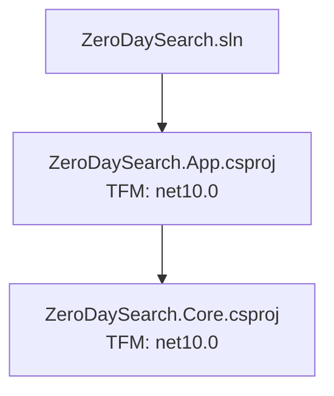

# Build event log inspection

This document specifies how `dotnet-inspect` should inspect managed .NET build event logs written by `dotnet build --event-log` and related SDK options.

The short version:

```bash
dotnet build --view summary --event-log
dotnet-inspect build <EventLogId> -S Errors
dotnet-inspect build <EventLogId> -S DiagnosticTypes --tsv
dotnet-inspect build <EventLogId> -S Diagnostics --code CS1061 --tsv
dotnet-inspect build <EventLogId> -S Errors --code CS1061 --markdown
```

`dotnet build` owns the baseline stdout view and event-log creation. `dotnet-inspect build` owns repeatable query, drill-down, grouping, and rich projections over the persisted event log.

> Current view-set note: `BUILD-EVENT-VIEWS.md` is the active feature tracker
> for view selection. It supersedes older mixed-row shortcut language in this
> design note: `Errors` and `Warnings` should be filtered `Diagnostics`
> projections that omit only the constant severity column, `Types` should be the
> diagnostic aggregate, and default `Projects` output should hide
> `RuntimeIdentifier` unless dimensions are requested.

## Goals

- Treat build JSONL as a durable data source, not as console text.
- Let agents use `dotnet build --view summary --event-log` for a terse baseline,
  then call `dotnet-inspect build <EventLogId>` only when deeper analysis is
  useful.
- Support both `EventLogId` and file path inputs.
- Keep the JSONL reader and JSON deserialization in a standalone library project.
- Define baseline build views once so SDK stdout and `dotnet-inspect build`
  cannot drift.
- Structure the `build` command like the rest of dotnet-inspect: command definition, options, section selection, row models, and renderer output should stay separated.
- Provide a superset of SDK stdout build views so users can regenerate simple summaries from dotnet-inspect.

## Non-goals

- Do not make `dotnet-inspect` run the build.
- Do not depend on MSBuild assemblies for reading JSONL.
- Do not put source-symbol definition lookup in the build command. Source ownership can be classified, but agents should use LSP/code intelligence to locate source definitions.
- Do not require users to know the JSONL path when an `EventLogId` is available.

## Project layout

Add a standalone build-event reader library:

```text
src/DotnetInspector.BuildEvents/
  DotnetInspector.BuildEvents.csproj
  BuildEventLogReader.cs
  BuildEventLog.cs
  BuildEventLogResolver.cs
  BuildEventJsonContext.cs
  Events/
    BuildEventEnvelope.cs
    BuildEventContextData.cs
    BuildEventPayloads.cs
  Projections/
    BuildSummary.cs
    DiagnosticTypeSummary.cs
    BuildGraphModel.cs
```

Then reference it from the CLI:

```text
src/dotnet-inspect/dotnet-inspect.csproj
  -> src/DotnetInspector.BuildEvents/DotnetInspector.BuildEvents.csproj
```

The reader project should be usable independently by tests and future tools. It should not reference `dotnet-inspect`, `Microsoft.Build`, or rendering packages.

## Shared view contract

`dotnet build --view <name>` and `dotnet-inspect build <EventLogId> -S <Name>`
must render the same semantic view for the SDK-owned baseline views. The
baseline view implementation should be authored and tested in dotnet-inspect
first, where iteration is cheaper, then vendored or otherwise shared into the
SDK.

The shared boundary should be a small Markout-oriented view layer, not the
`dotnet-inspect` command implementation. The split is:

```text
Build event reader/model
  - JSONL reader, envelopes, payload DTOs, BuildEventLog, projections
  - no Microsoft.Build dependency
  - no renderer dependency

Shared build views
  - Summary, DiagnosticTypes
  - stable row names and Markout table/card definitions
  - all regular dotnet-inspect formats where applicable
  - golden output tests for Markdown/table/TSV/JSONL/JSON where applicable
  - vendorable into SDK/MSBuild without pulling in the dotnet-inspect CLI

dotnet-inspect-only views
  - Diagnostics filters
  - Errors/Warnings as filtered Diagnostics rows
  - Details Markdown cards with source context
  - Projects, Graph, Targets, Tasks, future timelines/performance/artifacts
```

The SDK should use the shared view definitions for baseline stdout and event-log
creation. `dotnet-inspect` should use the same shared view definitions when
regenerating SDK baseline views from persisted JSONL, then layer additional
query/drill-down views on top.

TSV is the SDK bootstrap format because the SDK side does not yet have Markout
infrastructure. It is not the view contract. The contract is the semantic view:
row names, columns, ordering, and field meanings. dotnet-inspect should expose
the shared baseline views through its regular output modes (`--markdown`,
`--table`, `--tsv`, `--jsonl`, and `--json`), and the SDK should converge on the
same Markout-backed rendering path when that infrastructure is available.

This avoids two bad outcomes:

1. Reimplementing the same view twice, which creates output drift.
2. Forcing all experimental query UX into the SDK, where iteration is slower.

If source vendoring is the practical SDK integration path, keep the vendored
surface deliberately small: event DTOs/projections needed by baseline views,
view definitions, and golden tests. Do not vendor command parsing, cache
resolution, source-context rendering, or advanced dotnet-inspect-only views.

## Prior art: MarkdownTableLogger

`~/git/markdown-table-logger` demonstrates the shape this system should grow
toward. It started as an MSBuild logger, but the useful architectural pattern is
not logger-specific:

```text
MSBuild events -> semantic schemas -> selectable views -> multiple renderers
```

Key lessons to preserve:

1. Define semantic row models first. The prototype used project results,
   diagnostics, diagnostic type summaries, context-aware diagnostics, and
   enhanced diagnostics with anchors/line ranges. Build events should use the
   same style: stable model first, renderer second.
2. Treat Markdown/table/TSV/JSON as renderings of the same view. TSV is useful
   for the SDK bootstrap, but Markdown, table, JSONL, and JSON should stay
   first-class in dotnet-inspect.
3. Keep baseline views small. The prototype's `projects`, `errors`, `types`,
   and `minimal` modes map to build-event `Summary`,
   `DiagnosticTypes`/`Types`, `Diagnostics`, and future compact views.
4. Compose rich prompt documents from smaller views. The prototype's prompt
   mode rendered a Projects table, a Build Errors table, and per-error detail
   sections. That points to a future dotnet-inspect-only build report composed
   from `Projects`, `Diagnostics`, and `Errors`.
5. Include random-access navigation in rich Markdown. The prototype added
   `Section` and `Lines` columns so agents could jump directly to details.
   Markout view metadata should support equivalent anchors/ranges without
   baking line-number hacks into the SDK.
6. Source context and symbol classification are enrichments, not baseline SDK
   output. The SDK should emit enough diagnostic/source identity to make them
   possible; dotnet-inspect can perform the richer source/symbol joins.
7. Keep optional helpers loosely coupled and failure-safe. The prototype's
   symbol indexer used CLI discovery plus daemon communication and degraded when
   unavailable. Future source/symbol enrichment should follow that pattern
   rather than making the build fail because an optional enrichment service is
   missing.

## Findings from real toolchain captures

`~/git/build-event-samples` contains reusable broken projects and captured
outputs from .NET dogfood SDK, Go 1.26.4, Cargo/rustc 1.95, and Swift 6.2.3.
Those captures suggest several changes to adopt.

### 1. Separate logical project counts from build execution counts

The dogfood .NET sample has two project files but emitted 14 `project.finished`
events:

```text
Kind Projects Failed Errors Warnings EventLogId
summary 14 1 4 0 20260612T180827.6835063Z-2188249-build-1ef85561
```

This is technically accurate if `Projects` means project executions, but it is
surprising for users and agents. We should model both concepts explicitly:

| Concept | Meaning | Candidate column |
| --- | --- | --- |
| Logical project | Unique project path + dimensions relevant to user triage | `Projects` |
| Project execution | Every MSBuild project-started/finished instance | `ProjectExecutions` |
| Failed logical project | Any logical project with a failed execution | `Failed` |
| Failed execution | Count of failed project execution records | `FailedExecutions` |

Recommendation: baseline `Summary` should use logical counts for `Projects` and
`Failed`, with execution counts available in detailed JSON or a separate
`ExecutionSummary`/`Projects --detailed` view. If the SDK keeps execution counts
for now, name them explicitly to avoid drift and confusion.

### 2. Keep output events optional and filtered

The dogfood .NET sample emitted 3,434 `output` events for a tiny broken build,
while the high-signal data was only four diagnostics, fourteen project events,
and one build-finished event. Go 1.26 build JSON takes the opposite approach: it
mostly emits `build-output` strings and `build-fail`.

Recommendation: keep `output` as an optional channel for lossless/debugging
scenarios, not as the data source for baseline views. Baseline views should be
derived from structured lifecycle, diagnostic, and artifact events.

### 3. Adopt Cargo's explicit message-kind pattern

Cargo uses a top-level `reason` discriminator (`compiler-message`,
`compiler-artifact`, `build-script-executed`, `build-finished`) and a final
`build-finished` message with success. Our `kind` field already maps well to
this pattern.

Recommendation: keep `kind` as the discriminant, preserve unknown kinds, and
ensure every build emits a terminal `build.finished` event even after failure.

### 4. Add richer target/project identity for joins

Cargo includes `package_id`, `manifest_path`, and `target` metadata on compiler
messages and artifacts. This makes each message joinable to package/target
identity without parsing text.

Recommendation: ensure diagnostics, artifacts, project results, and target/task
events can all be joined by stable IDs:

| Needed identity | Current status | Recommendation |
| --- | --- | --- |
| Project file/path | Present | Also expose repo-relative path in projections, not raw events. |
| Project context ID | Present | Keep for execution joins. |
| Logical project key | Derived | Define as project path + TFM + RID + configuration. |
| Build root / working directory | Missing | Add build metadata or manifest. |
| Target identity | Partial | Include target kind/name and project context consistently. |

### 5. Consider rustc-style diagnostic spans as a future shape

rustc diagnostics include structured spans with:

- file name
- byte start/end
- line/column start/end
- primary-span flag
- source text for highlighted lines
- labels
- suggested replacements and applicability
- child notes/help diagnostics

.NET currently emits one primary diagnostic location with line/column/end
line/end column and message. That is enough for early views, but not enough to
match rustc's fix-oriented diagnostics.

Recommendation: keep the current simple diagnostic payload for v0, but reserve a
future `spans` shape rather than adding one-off fields. Do not include source
text by default until the privacy/size policy is settled; prefer source digests
and let dotnet-inspect read current source with freshness checks. If Roslyn
eventually supplies code actions or suggestions, model them explicitly with
applicability instead of embedding them in strings.

Candidate future shape:

```json
{
  "kind": "diagnostic",
  "payload": {
    "severity": "error",
    "code": "CS1061",
    "message": "'Query' does not contain a definition for 'Tokens'",
    "spans": [
      {
        "file": "src/SearchService.cs",
        "lineStart": 42,
        "columnStart": 17,
        "lineEnd": 42,
        "columnEnd": 23,
        "isPrimary": true,
        "label": "missing member"
      }
    ],
    "children": [],
    "suggestions": []
  }
}
```

### 6. Add artifact events before building artifact views

Cargo emits `compiler-artifact` messages with `filenames`, `executable`,
profile, features, and whether the artifact was fresh. rustc can also emit
artifact notifications with an artifact kind.

Recommendation: define a stable .NET artifact vocabulary before implementing
`Artifacts`:

```text
assembly
pdb
package
apphost
deps-json
runtimeconfig-json
generated-file
intermediate
```

Artifact events should include project identity, logical project dimensions,
path, kind, and freshness/up-to-date status if known.

### 7. Use a manifest for repository/build metadata

Go, Cargo, and rustc event streams do not include git commit. MarkdownTableLogger
captured git metadata in a separate manifest. That still looks like the right
layering.

Recommendation: keep the JSONL stream focused on build events and put optional
repository/build invocation metadata in a manifest:

```text
<EventLogId>.jsonl
<EventLogId>.manifest.json
```

Candidate manifest fields:

```json
{
  "eventLogId": "20260612T180827.6835063Z-2188249-build-1ef85561",
  "command": "dotnet build --view summary samples/dotnet/ZeroDaySearch/src/ZeroDaySearch.App/ZeroDaySearch.App.csproj",
  "workingDirectory": "/home/rich/git/build-event-samples",
  "repoRoot": "/home/rich/git/build-event-samples",
  "gitCommit": "optional",
  "gitBranch": "main",
  "gitDirty": true,
  "sdkVersion": "11.0.100-dev",
  "eventSchemaVersion": 0
}
```

The manifest can power reports and relative paths without making source-control
state a required build event.

## Event log identity and resolution

SDK stdout should expose an `EventLogId`, not a raw path:

```text
Kind Projects Failed Errors Warnings EventLogId
summary 79 0 0 0 20260611T204959.4267725Z-444050-build-e560d110
```

The SDK-managed path is an implementation detail:

```text
~/.dotnet/build-events/2026-06-11/20260611T204959.4267725Z-444050-build-e560d110.jsonl
```

`dotnet-inspect build` should accept either:

```bash
dotnet-inspect build 20260611T204959.4267725Z-444050-build-e560d110
dotnet-inspect build ~/.dotnet/build-events/2026-06-11/20260611T204959.4267725Z-444050-build-e560d110.jsonl
```

Resolution order:

1. If the argument is an existing file path, read it directly.
2. If the argument looks like an `EventLogId`, resolve it from the managed event-log store.
3. If exact ID lookup fails, optionally search recent managed event-log directories and report close matches.
4. If unresolved, return a friendly error with examples.

Candidate managed store:

```text
~/.dotnet/build-events/YYYY-MM-DD/<EventLogId>.jsonl
~/.dotnet/build-events/YYYY-MM-DD/<EventLogId>.diagnostics.tsv
```

If the SDK later supports `--event-log-file <PATH>` with an exact file path, it should also write an index/manifest entry so an `EventLogId` can still resolve to that path.

## Reader library contract

The reader should parse JSONL line-by-line:

```csharp
await foreach (BuildEventEnvelope envelope in BuildEventLogReader.ReadAsync(path, cancellationToken))
{
    // Dispatch known event kinds, preserve unknowns.
}
```

Envelope shape:

```json
{
  "schemaVersion": 0,
  "kind": "diagnostic",
  "sequenceNumber": 42,
  "timestamp": "2026-06-11T20:49:59.4267725Z",
  "threadId": 12,
  "context": { },
  "payload": { }
}
```

Reader requirements:

- Read one line at a time.
- Ignore blank lines.
- Preserve sequence order.
- Dispatch known `kind` values to typed payloads.
- Preserve unknown event kinds as `UnknownBuildEvent`.
- Ignore unknown fields on known payloads.
- Use source-generated `System.Text.Json` context so the CLI remains AOT-friendly.
- Avoid `Microsoft.Build` dependencies; enums or payload values from MSBuild should be represented as strings or local DTOs.

Known initial event kinds:

```text
build.started
build.finished
project.started
project.finished
target.started
target.finished
task.started
task.finished
diagnostic
output
artifact
summary
extension
unknown
```

The schema is currently experimental (`schemaVersion: 0`). `dotnet-inspect` should reject future stable breaking schema versions only when it cannot safely continue.

## Source freshness and digests

Rich diagnostic Markdown wants source context:

````markdown
### Program.cs:42:15

- File: Program.cs
- Lines: 38-46
- Error: CS0103
- Message: The name 'undefinedVar' does not exist in the current context

```csharp
    public void ProcessData() {
        var data = GetData();
        Console.WriteLine(undefinedVar); // ← CS0103
        return result;
    }
```

Referenced symbols:
- `Console` - .NET Libraries (System.Console)
- `WriteLine` - .NET Libraries
- `undefinedVar` - undefined symbol
- `data` - Program.cs:39,13
```

The build has a stronger freshness guarantee than a later query: while the build is running, source diagnostics refer to the source as compiled. After the event log is at rest, local files may have changed.

The JSONL log should therefore include enough source file identity for dotnet-inspect to detect stale source context. The preferred minimal data is a digest for each source file referenced by a diagnostic.

Possible designs:

1. Add digest fields to each diagnostic payload:

   ```json
   {
     "file": "/repo/src/Program.cs",
     "lineNumber": 42,
     "columnNumber": 15,
     "sourceFileHash": "sha256:...",
     "sourceFileLength": 1234
   }
   ````

1. Emit separate source file identity events and reference them from diagnostics:

   ```json
   {
     "kind": "source.file",
     "payload": {
       "path": "/repo/src/Program.cs",
       "hash": "sha256:...",
       "length": 1234
     }
   }
   ```

   Diagnostics then carry only the source path and dotnet-inspect joins to the latest `source.file` event for that path.

Prefer the separate event if many diagnostics reference the same file; prefer payload fields if implementation simplicity matters more for the first slice.

dotnet-inspect behavior:

- When rendering source context, recompute the current file digest if the file exists.
- If the digest matches the build-time digest, render source context normally.
- If the digest differs, render a clear freshness warning and still show current source context only if requested/appropriate.
- If the file is missing, render diagnostic metadata and state that source context is unavailable.

Example warning:

```text
Source file changed since build: src/Program.cs
Build hash: sha256:...
Current hash: sha256:...
```

The JSONL should not store full source text by default. Digests provide freshness without bloating the event stream or capturing source content unnecessarily.

## Command structure

Keep the `build` command shaped like existing dotnet-inspect commands:

```text
CommandLine/Commands/BuildCommandDefinitions.cs
  - wires arguments and options

Commands/BuildCommand.cs
  - orchestration only
  - resolves EventLogId/path
  - loads BuildEventLog
  - selects section
  - invokes projection/renderer

BuildEvents library
  - JSONL reader
  - DTOs
  - basic projections that are rendering-independent
```

Avoid letting `BuildCommand.cs` grow into a large all-in-one parser, query engine, and renderer. Initial prototype code can be split along these seams as it matures.

## Command-line shape

Base command:

```bash
dotnet-inspect build <event-log-id-or-path>
```

Shared dotnet-inspect output options should apply:

```bash
--table
--tsv
--jsonl
--json
--markdown
--mermaid
-S, --select
-D, --discover
--columns
--no-headers
-n
--count
```

Build-specific filters:

```bash
--code <CODE>          # diagnostic code, e.g. CS1061
--severity <LEVEL>     # error, warning
--project <PATTERN>    # project path/name filter
--file <PATTERN>       # source file path filter
```

Use existing `-n` row limiting for ranked views. For diagnostic types, default top count is 6.

## Initial sections/views

The `build` command should expose a focused superset of SDK stdout views.
The default `dotnet-inspect build <EventLogId>` section is `Summary`; agents
should select `DiagnosticTypes`, `Diagnostics`, or `Errors` when they need
progressively deeper views.

### Summary

Purpose: regenerate the SDK `--view summary` shape.

```bash
dotnet-inspect build <EventLogId> -S Summary --tsv
```

Columns:

```text
Kind Projects Failed Errors Warnings EventLogId
summary 79 0 0 0 20260611T204959.4267725Z-444050-build-e560d110
```

Notes:

- No emoji.
- Summary should include the `EventLogId` if known.
- If input was a raw path and no ID is known, `EventLogId` can be empty or a synthetic ID derived from managed index metadata if available.

### DiagnosticTypes

Purpose: rank unique diagnostic codes.

```bash
dotnet-inspect build <EventLogId> -S Types --tsv
dotnet-inspect build <EventLogId> -S DiagnosticTypes --tsv
dotnet-inspect build <EventLogId> -S DiagnosticTypes --tsv -n 10
```

`Types` is the SDK-compatible alias for `DiagnosticTypes`, matching
`dotnet build --view types`.

Default `-n`: 6.

Columns:

```text
Kind Severity Code Count
diagnostic-type error CS1061 34
diagnostic-type error CS0103 7
diagnostic-type error CS1739 6
diagnostic-type error CS1729 4
```

Sorting:

1. Count descending.
2. Severity priority: error before warning.
3. Code ascending.

This view is likely more naturally owned by dotnet-inspect than SDK stdout because it is an aggregation query over the persisted event log.
It shows both errors and warnings by default, sorted with errors ahead of
warnings when counts tie.

### Diagnostics

Purpose: cheap drill-down list.

```bash
dotnet-inspect build <EventLogId> -S Diagnostics --code CS1061 --tsv
```

Default columns for `--code` drill-down:

```text
File Line Column
src/Foo.cs 42 17
src/Bar.cs 10 9
```

Full columns when no projection is requested:

```text
Severity Code Project File Line Column Message
```

Path policy:

- Prefer paths relative to the build working directory or repo root when known.
- Keep absolute paths available in JSON if needed.

### Errors

Purpose: rich Markdown diagnostic cards.

```bash
dotnet-inspect build <EventLogId> -S Errors --code CS1061 --markdown
dotnet-inspect build <EventLogId> -S Errors --diagnostic E7 --markdown
```

Markdown shape:

````markdown
## CS1061

### src/Foo.cs:42:17

- Project: src/App/App.csproj
- Error: CS1061
- Message: 'Foo' does not contain a definition for 'Bar'

```csharp
    var foo = GetFoo();
    var value = foo.Bar();
                    ^
    Console.WriteLine(value);
```

Referenced symbols:
- `Foo` - source
- `Bar` - unknown

````

Context policy:

- Include five lines of source context by default.
- Mark the error line with an arrow/caret.
- If source cannot be read, still render diagnostic metadata and explain that source context is unavailable.
- Verify build-time source digest before presenting local source context as authoritative.

Symbol policy:

- Classify symbols as source, dependency/framework/package, or unknown.
- Do not perform source definition lookup in this view. Use LSP/code intelligence when a symbol is source-owned.

### Heuristic fix hints

Rust diagnostics often include structured hints for what to do next. .NET compiler/MSBuild diagnostics do not currently provide an equivalent command-line experience in a stable, structured way. The right long-term owner for authoritative fixes is Roslyn code-fix/code-action infrastructure, but dotnet-inspect can prototype the experience first.

dotnet-inspect should add clearly labeled heuristic hints to rich Markdown error views:

```markdown
**Heuristic fix hints:**
- `CS1061`: The receiver type likely does not define this member.
- Check whether the member is an extension method requiring a missing `using`.
- If the receiver type is from a dependency, inspect available members with dotnet-inspect.
- For authoritative fixes, query Roslyn code actions for this diagnostic span.
```

Initial heuristic catalog:

| Diagnostic | Hint direction |
| --- | --- |
| `CS0246` | Type/namespace not found: check missing `using`, project reference, package reference, or generated source. |
| `CS0103` | Name not found: check typo, scope, missing local/field/member, or generated symbol. |
| `CS1061` | Member not found: inspect receiver type; check missing extension method namespace/package. |
| `CS1729` | Constructor overload mismatch: inspect available constructors for the target type. |
| `CS1739` | Named argument mismatch: inspect callable parameter names. |
| `CS1501` | Overload arity mismatch: inspect available overloads and argument counts. |

Rules:

- Label these as heuristic, not authoritative.
- Prefer hints that suggest the next inspection command or code-intelligence action.
- Do not claim that a fix is definitely correct unless a future Roslyn-backed provider says so.
- Keep hints compact and deterministic so they are useful in agent evals.

Evidence path for Roslyn:

1. Prototype heuristic hints in `dotnet-inspect build -S Details --markdown`.
2. Run agent evals and collect examples where hints help routing but remain approximate.
3. Use those examples to justify a Roslyn-backed CLI/query API for code actions over a project + diagnostic span.
4. Replace or augment heuristic hints with structured Roslyn fixes when available.

Potential future Roslyn-backed shape:

```text
fix source title Applicability EditKind
fix roslyn Add using System.Text.Json MachineApplicable text-edit
fix roslyn Generate class UndefinedType MaybeIncorrect text-edit
```

The build event log should carry diagnostic locations and source file digests; Roslyn or dotnet-inspect can use those to request authoritative fixes later. The SDK/MSBuild layer should not invent semantic fixes.

### Projects

Purpose: project health and large-solution triage.

```bash
dotnet-inspect build <EventLogId> -S Projects --tsv
```

Columns:

```text
Project TargetFramework RuntimeIdentifier Errors Warnings Succeeded
```

This should likely stay a requested view, not the default agent baseline, because all-project output can be noisy.

### Graph

Purpose: structural overview.

```bash
dotnet-inspect build <EventLogId> -S Graph --mermaid
```

This should support project-only and later stage/category-filtered graphs. It belongs in dotnet-inspect, not SDK stdout.

### Targets and Tasks

Purpose: detailed build debugging.

```bash
dotnet-inspect build <EventLogId> -S Targets --tsv
dotnet-inspect build <EventLogId> -S Tasks --tsv
```

These are detailed escape hatches for target/task investigations and should not appear in baseline stdout.

## View mockups and data requirements

These mockups are decision aids. They are inspired by MarkdownTableLogger's
`projects`, `errors`, `types`, `minimal`, and `prompt` modes, but expressed as
dotnet-inspect sections over a persisted event log. The key design question for
each view is whether the JSONL event stream already contains enough semantic
data to render it without guessing.

| View | Alias / command | Owner | Data readiness | Recommendation |
| --- | --- | --- | --- | --- |
| Summary | `-S Summary`, SDK `--view summary` | Shared baseline | Ready | Implement first; golden-test with SDK TSV. |
| DiagnosticTypes | `-S Types`, `-S DiagnosticTypes`, SDK `--view types` | Shared baseline | Ready | Implement first; this is the cheapest high-signal failure view. |
| Projects | `-S Projects` | dotnet-inspect | Mostly ready | Implement early for large-solution triage. |
| Diagnostics | `-S Diagnostics` | dotnet-inspect | Ready | Implement filters before making this a default workflow. |
| Errors | `-S Errors` | dotnet-inspect | Ready | Filtered diagnostic rows for build-breaking diagnostics. |
| Details | `-S Details --markdown` | dotnet-inspect | Partial | Compose from other views; needs command/duration/source identity for full value. |
| Explain | `-S Explain --markdown` | dotnet-inspect | Partial | Cluster docs: applies-to codes, likely cause, first fixes, follow-up commands. |
| Graph | `-S Graph --mermaid` | dotnet-inspect | Ready for project graph | Keep dotnet-inspect-only. |
| Timeline | `-S Timeline` | dotnet-inspect | Partial | Needs started/finished pairing and duration projection. |
| Artifacts | `-S Artifacts` | dotnet-inspect | Depends on artifact events | Add after artifact events are emitted consistently. |

### Summary mockup

Purpose: one-row health check for humans, agents, CI logs, and follow-up
`dotnet-inspect` commands.

```bash
dotnet build --view summary
dotnet-inspect build <EventLogId> -S Summary --tsv
```

```text
Kind    Projects    Failed    Errors    Warnings    EventLogId
summary 7           1         51        0           20260612T053144.8607492Z-1256316-build-e560d110
```

Markdown/table rendering should use the same semantic row:

| Kind | Projects | Failed | Errors | Warnings | EventLogId |
| --- | ---: | ---: | ---: | ---: | --- |
| summary | 7 | 1 | 51 | 0 | 20260612T053144.8607492Z-1256316-build-e560d110 |

Required data:

| Data | Current log? | Notes |
| --- | --- | --- |
| EventLogId | Yes, from managed path | Prefer explicit manifest/index later. |
| Logical project count | Derived | Count unique project path + dimensions; do not expose execution count as `Projects`. |
| Failed logical project count | Derived | Any logical project with a failed execution. |
| Project execution count | Yes | Keep for detailed views as `ProjectExecutions`. |
| Error/warning counts | Yes | Count `diagnostic` rows by severity. |

### DiagnosticTypes / Types mockup

Purpose: prioritize a failure by diagnostic code before reading individual
diagnostics.

```bash
dotnet build --view types
dotnet-inspect build <EventLogId> -S Types --tsv
dotnet-inspect build <EventLogId> -S DiagnosticTypes --json
```

```text
Kind            Severity    Code    Count
diagnostic-type error       CS1061  34
diagnostic-type error       CS0103  7
diagnostic-type error       CS1739  6
diagnostic-type error       CS1729  4
```

JSON rendering should preserve the same row shape:

```json
[
  {"kind":"diagnostic-type","severity":"error","code":"CS1061","count":34},
  {"kind":"diagnostic-type","severity":"error","code":"CS0103","count":7}
]
```

Required data:

| Data | Current log? | Notes |
| --- | --- | --- |
| Diagnostic severity | Yes | Error before warning on ties. |
| Diagnostic code | Yes | Empty/unknown codes should still group deterministically. |
| Count | Derived | Default top count is 6; `-n` changes it. |

### Projects mockup

Purpose: large-solution triage. This answers "which projects are unhealthy?"
without printing every diagnostic.

```bash
dotnet-inspect build <EventLogId> -S Projects --table
```

```text
Project                         TargetFramework RuntimeIdentifier Errors Warnings Succeeded
src/ZeroDaySearch/App.csproj    net10.0          linux-x64         51     0        false
src/ZeroDaySearch.Core.csproj   net10.0                            0      0        true
src/ZeroDaySearch.Tests.csproj  net10.0                            0      0        true
```

Required data:

| Data | Current log? | Notes |
| --- | --- | --- |
| Project identity | Yes | Prefer repo-relative display path. |
| TFM/RID/configuration | Yes | From project dimensions. |
| Per-project success | Yes | `project.finished.succeeded`. |
| Execution count | Derived | Useful for diagnosing restore/build duplication. |
| Per-project diagnostic counts | Mostly | Use diagnostic context/projectFile; ensure every diagnostic has project identity. |

Potential log gap: a build working directory or repo root event would make
relative path projection deterministic.

### Diagnostics mockup

Purpose: cheap drill-down after `Types`; it should be narrow by default when a
code filter is used.

```bash
dotnet-inspect build <EventLogId> -S Diagnostics --code CS1061 --tsv
```

```text
File                     Line  Column
src/SearchService.cs     42    17
src/SearchService.cs     44    21
src/TokenPipeline.cs     88    13
```

Without a code filter, use a fuller table:

```text
Severity Code   Project                       File                  Line Column Message
error    CS1061 src/ZeroDaySearch/App.csproj  src/SearchService.cs  42   17     'Query' does not contain 'Tokens'
error    CS0103 src/ZeroDaySearch/App.csproj  src/Program.cs        12   9      The name 'builderr' does not exist
```

Required data:

| Data | Current log? | Notes |
| --- | --- | --- |
| Severity/code/message | Yes | From `diagnostic` payload. |
| File/line/column/end span | Yes | End span available for richer future projections. |
| Project identity | Yes | `projectFile` plus context. |
| Relative paths | Partial | Needs build working directory/repo root for deterministic projection. |

### Errors mockup

Purpose: Markdown cards for fixing build errors. This is the spiritual
successor to MarkdownTableLogger prompt details, but it should be queried from a
durable event log instead of produced only during the build.

```bash
dotnet-inspect build <EventLogId> -S Errors --code CS1061 --markdown
```

````markdown
## CS1061

Matched diagnostics: 34
Rendered details: 5

| Id | Digest | File | Line | Column | Section | Lines |
| --- | --- | --- | ---: | ---: | --- | --- |
| E7 | CS1061:7f3a2c | src/SearchService.cs | 42 | 17 | src/SearchService.cs:42:17 | 41-62 |

### E7 CS1061:7f3a2c src/SearchService.cs:42:17

- Project: src/ZeroDaySearch/App.csproj
- Error: CS1061
- Message: 'Query' does not contain a definition for 'Tokens'
- Source: current file matches build digest

```csharp
    var query = CreateQuery(input);
    var tokens = query.Tokens;
                    ^
    return Search(tokens);
```

**Heuristic fix hints:**
- Inspect the receiver type and available members.
- Check whether `Tokens` is an extension method requiring a missing `using`.

**Referenced symbols:**
- `CreateQuery` - source
- `Query` - source
- `Tokens` - unknown
````

Required data:

| Data | Current log? | Notes |
| --- | --- | --- |
| Diagnostic metadata | Yes | File, span, code, message, project. |
| Stable selector | Derived | Per-view selectors such as `E7`, `W3`, `D12`; deterministic for one event log/query ordering. |
| Stable digest | Derived | Hash severity + code + normalized project/file + line + column + message. |
| Source context | Partial | Can read current file, but needs build-time digest for freshness. |
| Source digest / file identity | No | Add `source.file` event or payload hash fields. |
| Symbol classification | No | dotnet-inspect/LSP/Roslyn enrichment, not SDK baseline. |
| Heuristic hints | Derived | Deterministic dotnet-inspect catalog by diagnostic code. |

Bulk controls:

- Filter first with `--code`, `--severity`, `--project`, or `--file`.
- Render one rich card by default.
- Limit rich cards explicitly with `--cards N` or `--tail-cards N`.
- Use `--diagnostic E7` or `--diagnostic CS1061:7f3a2c` to render one card.
- Always report matched diagnostic count and rendered detail count.

### Details mockup

Purpose: one Markdown document optimized for agent handoff and random access. It
is composed from smaller views and should be dotnet-inspect-only.

```bash
dotnet-inspect build <EventLogId> -S Details --markdown
```

````markdown
# Build report

EventLogId: 20260612T053144.8607492Z-1256316-build-e560d110
Command: dotnet build --view summary ~/git/bad-code/ZeroDaySearch/
Result: failed

## Projects

| Project | Errors | Warnings | Succeeded |
| --- | ---: | ---: | --- |
| src/ZeroDaySearch/App.csproj | 51 | 0 | false |

## Diagnostic Types

| Severity | Code | Count |
| --- | --- | ---: |
| error | CS1061 | 34 |
| error | CS0103 | 7 |

## Build Errors

| File | Line | Column | Code | Section | Lines |
| --- | ---: | ---: | --- | --- | --- |
| src/SearchService.cs | 42 | 17 | CS1061 | src/SearchService.cs:42:17 | 41-62 |

## Error Details

### src/SearchService.cs:42:17

...
````

Required data:

| Data | Current log? | Notes |
| --- | --- | --- |
| Summary/projects/types/diagnostics | Mostly | Composed from other views. |
| Diagnostic selectors/digests | Derived | Needed for compact index plus random-access rich cards. |
| Build command | No | Add build metadata event if desired. |
| Duration | Partial | Can infer from build started/finished timestamps if present. |
| EventLogId/path | Yes | From path today; manifest later. |
| Source context/digest | Partial/No | Same gap as `Errors`. |
| Section/line ranges | Derived | Markout metadata should own anchors/ranges. |

### Graph mockup

Purpose: structural overview for project relationships.

```bash
dotnet-inspect build <EventLogId> -S Graph --mermaid
```



Required data:

| Data | Current log? | Notes |
| --- | --- | --- |
| Project contexts | Yes | From `project.started`. |
| Parent project context | Yes | From `parentContext`. |
| Logical dimensions | Yes | TFM/RID/configuration dimensions. |
| Solution/root node | Partial | May need explicit build request/root metadata. |

### Timeline mockup

Purpose: performance and ordering investigations. This is not an SDK baseline
view.

```bash
dotnet-inspect build <EventLogId> -S Timeline --table
```

```text
Kind    Project                       Target          Task  Started       DurationMs  Succeeded
target  src/ZeroDaySearch/App.csproj  CoreCompile           00:00:01.120  2384        false
task    src/ZeroDaySearch/App.csproj  CoreCompile     Csc   00:00:01.244  2110        false
target  src/ZeroDaySearch/App.csproj  ResolveReferences     00:00:00.430  310         true
```

Required data:

| Data | Current log? | Notes |
| --- | --- | --- |
| Event timestamps | Yes | Envelope timestamp. |
| Started/finished pairs | Yes in schema | Reader/projections must index finished events too. |
| Success per target/task | Yes in schema | `target.finished` and `task.finished`. |
| Stage/category | Partial | Add stage classifier or derive from target/task names. |

### Artifacts mockup

Purpose: answer "what did this build produce?" and support follow-up inspection.

```bash
dotnet-inspect build <EventLogId> -S Artifacts --table
```

```text
Kind      Project                       TargetFramework RuntimeIdentifier Path
assembly  src/ZeroDaySearch/App.csproj  net10.0          linux-x64         artifacts/bin/ZeroDaySearch/release/ZeroDaySearch.dll
pdb       src/ZeroDaySearch/App.csproj  net10.0          linux-x64         artifacts/bin/ZeroDaySearch/release/ZeroDaySearch.pdb
package   src/ZeroDaySearch/App.csproj  net10.0                            artifacts/package/release/ZeroDaySearch.1.0.0.nupkg
```

Required data:

| Data | Current log? | Notes |
| --- | --- | --- |
| Artifact path | In schema | Requires consistent `artifact` events from SDK/MSBuild. |
| Artifact kind | In schema | Needs stable vocabulary: assembly, pdb, package, apphost, generated-file. |
| Project/dimensions | Partial | Artifact payload should include project identity and dimensions or join key. |

### Candidate implementation order

1. Shared baseline: `Summary`, `Types`/`DiagnosticTypes`.
2. Early dotnet-inspect triage: `Projects`, `Diagnostics` with filters.
3. Fix loop: `Details --markdown` with source freshness metadata.
4. Composed details: `Details --markdown` once anchors/ranges and source freshness
   are modeled cleanly.
5. Investigations: `Graph`, `Timeline`, `Artifacts`, `Targets`, `Tasks`.

## Discovery

`-D` should report sections:

```bash
dotnet-inspect build <EventLogId> -D
```

Initial sections:

```text
Summary
DiagnosticTypes
Diagnostics
Errors
Projects
Graph
Targets
Tasks
```

`-D <section>` should report columns or shape details:

```bash
dotnet-inspect build <EventLogId> -D DiagnosticTypes
```

```text
Kind column
Severity column
Code column
Count column
```

## Output format rules

- `Summary`, `DiagnosticTypes`, `Diagnostics`, `Projects`, `Targets`, and
  `Tasks` are row-oriented sections and support `--table`, `--tsv`, `--jsonl`,
  and `--json`.
- `Errors` supports Markdown by default. With `--tsv`, `--jsonl`, or `--json`, it should render row-oriented diagnostic data rather than source-context cards.
- `Graph` supports `--mermaid`; with `--json`, return the graph model or mermaid string in a JSON object.
- Multiple sections with row-oriented formats should follow existing dotnet-inspect rules: either require a single section or promote to Markdown/JSON where appropriate.

## Implementation phases

### Phase 1: library extraction

- Create `DotnetInspector.BuildEvents`.
- Move current build JSONL DTOs and reader from `src/dotnet-inspect/Commands/BuildCommand.cs`.
- Add tests for:
  - line-by-line JSONL reading
  - unknown event preservation
  - unknown field tolerance
  - `EventLogId` to path resolution

### Phase 2: command refactor

- Keep `BuildCommandDefinitions` thin.
- Add build-specific options: `--code`, `--severity`, `--project`, `--file`.
- Split sections/projections out of `BuildCommand.cs`.
- Keep current sections working: Projects, Diagnostics, Errors, Targets, Tasks, Graph.

### Phase 3: shared baseline views

- Add shared Markout-oriented implementations for `Summary` and
  `DiagnosticTypes`.
- Ensure dotnet-inspect can regenerate the simple SDK summaries from JSONL with
  the same semantic rows as SDK stdout.
- Add golden output tests that can be run on both the dotnet-inspect source and
  the SDK-vendored copy.
- Match SDK TSV column names exactly for the shared baseline views while keeping
  dotnet-inspect support for its regular Markdown, table, TSV, JSONL, and JSON
  formats.

### Phase 4: diagnostic drill-down

- Add `Diagnostics --code CS1061 --tsv` with relative file, line, column.
- Add `Errors --code CS1061 --markdown` with source context and referenced symbol classification.

### Phase 5: richer projections

- Graph/stage/category filtering.
- Timeline/performance views.
- Artifact views.

## Exit codes

- `0`: log read and requested view rendered successfully, even if the build represented by the log failed.
- `1`: input log cannot be found/read, event ID cannot be resolved, section/filter invalid, or rendering fails.

Build success/failure is data in the view, not the dotnet-inspect process exit code.

## Open questions

- Exact `EventLogId` manifest/index format and where it should live.
- Whether `--code` should accept multiple codes.
- Whether Markdown source context default should be five total lines or five lines before/after. Current user direction says "5 lines of source code"; start with a compact five-line window centered on the diagnostic.
