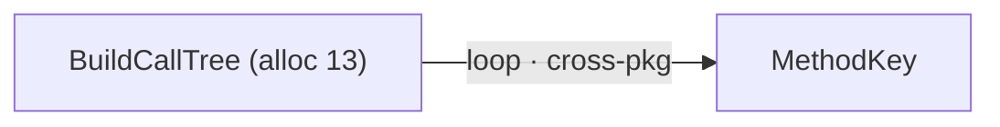

# Call graph characteristics

Descriptive layers on a **member-centric** call graph: topology keeps identity;
characteristics carry optional richness. Same separation AnnotatedSource uses
for text vs facts/carets — here the carrier is the graph and the carets are
**arcs** (and node annotations).

| Owns | Does not own |
| ---- | ------------ |
| Characteristic model, catalogs, subject binding, viewer selection, sink projection | How the graph is **built** ([modes](call-graph-modes.md), #4133) |
| Folding today’s node `--fields` into one catalog | Cross-library body resolution (#3632) |
| Edge description beyond loop labels | Integrations census sections ([integrations.md](integrations.md)) as tables |

Tracking: [#4139](https://github.com/richlander/dotnet-inspect/issues/4139).  
Consumer north star: [IChatClient dual-lens demo](../workflows/discovery/aspire-ai-package-graph.md).

Related:

- [Call-graph projection](call-graph-projection.md) — topology, identity, edges
- [Graph signal annotations](graph-signal-annotations.md) — current node signals via `--fields` (fold in; do not fork)
- [Call graph modes](call-graph-modes.md) — seed-centric vs ad hoc
- [Hidden-fact annotations](hidden-fact-annotations.md) / [caret stacking](caret-stacking.md) — AnnotatedSource fact/display split
- [Integrations](integrations.md) — section currency that arcs may **cite**, not replace

## Problem

Member identity and call evidence are right for “what calls what.” Demos and
triage still need description that is **not** identity:

- package / library / type **context** without making those the node id
- **arc** meaning (call kind, loop, package boundary, integration relationship)
- body **signals** (alloc, throw, …) already partially on nodes
- optional Findings overlays
- lean defaults; density only when selected

Today most description is formatted into node label strings. Edges expose almost
only `LoopLabel` (`CallGraphEdge` → Markout `GraphEdge.Label`). Package webs and
integration stories live in **other** sections (`extensions` tables, `Integration:*`),
so dual-lens demos are presenter-stitched.

AnnotatedSource lesson: **carrier + facts + targets + viewer filter**, not a
fatter string. Call graph analogue: **topology + characteristics + subject
binding + viewer filter**.

## Envelope

```text
CallGraphDocument (conceptual)
  nodes[]              // member identity + optional groups
  edges[]              // call evidence identity (caller → callee)
  focus?               // seed-centric mode; absent or multi in ad hoc
  characteristics[]    // first-class descriptors
```

Each characteristic:

| Field | Role |
| ----- | ---- |
| `id` | Stable within the document |
| `layer` | Catalog layer (scale, body-cost, relationship, …) |
| `subject` | `node` \| `edge` \| (later) `path` / `group` |
| `subjectRef` | Node id or edge/row id |
| `key` | Field name within the layer (`alloc`, `integration`, …) |
| `value` | Typed payload (count, enum, string token, finding id) |
| `provenance` | Optional: which analysis/index produced it |

**Identity never moves into characteristics.** Changing selected layers must not
change which member an edge connects.

Groups (package, library, type) are **aggregation / presentation lenses** over
the same nodes. A package label may appear as a group header, a node
characteristic, and/or an edge boundary characteristic — still not a second IR.

## Layers (v1 catalog)

Illustrative and open to growth. Implementation maps existing surface first.

### Node layers

| Layer | Keys (examples) | Today |
| ----- | --------------- | ----- |
| **Identity display** | spelling, truncated name | Always in node text (not a selectable characteristic) |
| **Scale** | `fanin`, `fanout`, `depth` | `--fields` defaults / scale cues |
| **Body cost / risk** | `alloc`, `copy`, `unsafe`, `reflection`, `throw`, `catch`, `finally`, `exceptions`, `evidenceIL` | [graph-signal-annotations.md](graph-signal-annotations.md) |
| **Boundary** | `package`, `library`, `source` (`from <assembly>`) | Partial: `Source` / cross-assembly |
| **Type context** | declaring type, API surface role | Missing as structured field |
| **Findings** | finding id, kind | Opt-in later |

### Edge layers

| Layer | Keys (examples) | Today |
| ----- | --------------- | ----- |
| **Call facts** | `loop` / loop hint | `LoopLabel` only |
| **Relationship kind** | `call`, `callvirt`, `newobj`, … | In analysis; not projected as selectable edge fields |
| **Boundary** | `cross-package`, `cross-library`, from/to package ids | Missing |
| **Integration** | `Integration: AI`, category token | Missing on graph (lives in library sections) |
| **API spelling on relationship graphs** | adapter/method name on package-web style edges (`AsIChatClient`, `AddOpenAI`) | Missing as graph producer |
| **Resolution** | `external`, `external→resolved` | Incomplete node spelling; richer with #3632 |
| **Findings** | cycle witness row, finding id | Cycles exist separately; not edge characteristics yet |

**Integration on arcs** is the dual-lens demo’s pay dirt: the same currency
[integrations.md](integrations.md) lists becomes an edge (or edge+node) payload
when the graph is about wiring, not when every call edge is flooded with
section text.

## Viewer selection

Progressive disclosure matches the rest of the tool:

- **Default graph:** identity + minimal scale (current lean defaults). No body
  signals, no integration labels, no finding noise.
- **Node fields:** today’s `--fields` remains the user-facing selector for node
  layers; implementation should read a characteristic catalog rather than a
  one-off formatter forever.
- **Edge fields:** new selector (name TBD: `--edge-fields`, or a unified
  `node.alloc` / `edge.loop` syntax). Default empty or loop-only if loop is
  already shown.
- **Sinks project; they do not store.** Mermaid edge labels
  (`A -->|label| B`), tree suffixes, table columns, and JSON properties are
  **projections** of the selected characteristic set. Hosts must not each invent
  a second label grammar.

GitHub and Markout can render Mermaid edge labels when `GraphEdge.Label` is set;
the contract is still structured characteristics first.

## Relationship to modes and other maps

| Concern | Owner |
| ------- | ----- |
| Seed-centric vs ad hoc build | [call-graph-modes.md](call-graph-modes.md) / #4133 |
| Resolve external callees into bodies | #3632 |
| Depth / multi-lib UX surface | #3292 |
| Integrations as **sections** | [integrations.md](integrations.md) / #3629 roll-up |
| Reference touchpoints | #3630 (sibling map; may share presentation machinery) |
| Package `depends` | Dependency graph — not call graph |

Same **envelope** (nodes, edges, groups, focus, characteristics) can host:

1. **Call graph** — member nodes, call edges (this doc’s home).
2. **Package web** — hub type or builder → packages; arcs carry extends /
   method / integration (sibling **producer**; member- or type-keyed evidence
   underneath where real).
3. **Type rollup** — aggregation lens over member edges, not replacement
   identity.

Do not force `depends` or touchpoints to become call graphs.

## Dual lens (type ↔ package)

Characteristics are what make dual lens honest:

- **Type outward** — nodes stay members of/around a hub type; edge/node
  characteristics surface provider **packages** and integration kind.
- **Package inward** — scope or groups are packages; characteristics surface the
  **type** and adapter members that unify them.

Without a characteristic plane, “package call graph” collapses to either
relabeling nodes as packages (wrong identity) or leaving richness in side
tables (current state).

Locked demo arcs to enable when product catches up:

- `AsIChatClient` · `Integration: AI` on adapter edges  
- package group labels on OpenAI / Bedrock / Azure nodes  
- optional reference edge Azure.AI.OpenAI → OpenAI SDK  

## Mapping current code

| Piece | Role under this model |
| ----- | --------------------- |
| `CallGraphProjection` nodes/edges/focus/rows | Topology + identity (unchanged duty) |
| `CallGraphEdge.LoopLabel` | First edge characteristic projection (legacy field) |
| `CallTreePerf` / `MethodSignals` | Node body-cost / scale characteristic sources |
| `CallGraphSectionAdapter` `--fields` | Viewer selection + sink projection for **nodes** |
| `GraphEdge.Label` in Markout | Sink slot for **selected** edge characteristics |
| Library `Integration:*` sections | Authoritative integration **discovery**; graph cites tokens |

Slice order (from #4139):

1. **This doc + catalog** — done here; keep catalog in sync as keys land.
2. **Store off the label string** — projection/adapter builds labels from
   selected characteristics for nodes and edges.
3. **Edge field selection** — at least one edge characteristic beyond loop
   (e.g. cross-library boundary or call kind) in Mermaid + table/JSON.
4. **Package-web producer** (optional follow-up issue once envelope exists).
5. **Findings overlay** — opt-in characteristic kind.

## Non-goals

- Replacing member identity with package- or type-only nodes as the sole model.
- Putting every body Finding on every node by default.
- Faking multi-provider edges from seeds that do not reference those assemblies
  (e.g. `Aspire.Hosting.OpenAI.AddOpenAI` → MEAI/Bedrock).
- Blocking seed-centric demos until the full catalog lands.
- One mega-enum frozen forever — catalog grows like `MethodSignals` does today.

## Acceptance (design + later implementation)

Design (this document):

- [x] Member-centric substrate + characteristic plane named.
- [x] Current node signals mapped into the catalog.
- [x] Edge layers beyond loop described; dual-lens consumer cited.
- [x] Modes, integrations tables, and depends/touchpoints de-scoped.

Implementation (follow-up PRs citing #4139):

- [ ] Existing node signals remain; defaults stay lean.
- [ ] ≥1 edge characteristic beyond loop selectable in Mermaid and table/JSON.
- [ ] Package or library boundary expressible without node id = package.
- [ ] No second ad hoc label formatter per sink — one projection path.

## Worked projection sketch

Selected: node `alloc`, edge `loop`, edge `boundary=cross-package`.

```text
characteristics:
  { layer: body-cost, subject: node, ref: 2, key: alloc, value: 13 }
  { layer: call-facts, subject: edge, ref: row:4, key: loop, value: "loop" }
  { layer: boundary, subject: edge, ref: row:4, key: cross-package, value: true }
```

Mermaid projection (illustrative):



JSON/table sinks expose the same rows without parsing label strings.
