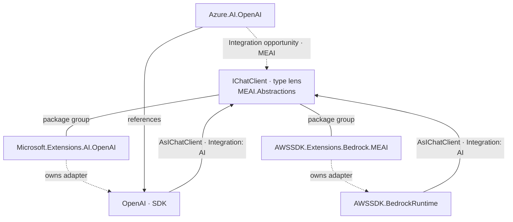

# Locked demo: `IChatClient` dual lens

> **One demo.** Start from a **type** and read **packages**; start from
> **packages** and land on the **type**. Same member-centric world; arcs carry
> integration richness the way AnnotatedSource carets carry facts.
>
> Status: **locked narrative + pins + works-now path.** Full single-diagram
> product experience is target (characteristics #4139, ad hoc mode #4133).

## Why this demo

| Need | Choice |
| ---- | ------ |
| Dual lens | Type `IChatClient` ↔ provider packages |
| Arc richness | `Integration: AI`, `AsIChatClient`, package boundary |
| Real ecosystems | OpenAI, Bedrock, Azure opportunity — not one vendor |
| Honest substrate | Members/adapters underneath; no fake edges from Aspire hosting |
| Tool flex | `type`, `implements`, `library -S Integration`, `member` CG, later one graph |

Aspire AppHost `AddOpenAI` is a **sibling** story (provisioning plane), not this
lock. See [Related demos](#related-demos-not-locked).

## Pins (freeze together)

| Role | Package | Version |
| ---- | ------- | ------- |
| Hub type owner | `Microsoft.Extensions.AI.Abstractions` | 10.9.0 |
| MEAI helpers | `Microsoft.Extensions.AI` | 10.9.0 |
| OpenAI adapter | `Microsoft.Extensions.AI.OpenAI` | 10.9.0 |
| OpenAI SDK | `OpenAI` | 2.12.0 |
| Bedrock adapter | `AWSSDK.Extensions.Bedrock.MEAI` | 4.0.101.8 |
| Azure SDK (opportunity / refs) | `Azure.AI.OpenAI` | 2.1.0 |

**Hub type:** `Microsoft.Extensions.AI.IChatClient`  
**Hero arcs (target spelling):** `AsIChatClient` · `Integration: AI`  
**Hero seeds (works-now CG):**

- `OpenAIClientExtensions.AsIChatClient` (ChatClient overload)
- `AmazonBedrockRuntimeExtensions.AsIChatClient`

## Target experience (one shareable graph)

What we want the product to emit (normative Mermaid — not an expect block yet):



**Read both ways:**

- **Type outward** — from `IChatClient`, packages and providers that adapt into it.  
- **Package inward** — from OpenAI/Bedrock/Azure packages, the type that unifies clients.

Arcs hold tool richness (integration kind, relationship, boundary). Nodes stay
member/type identity; package is group + characteristic (#4139).

## Works now (rehearsal path)

Run in order. This is the locked **manual dual-lens** until one command exists.

### Preconditions

```bash
export DOTNET_INSPECT_ISOLATED=ichatclient-dual-lens
dotnet-inspect cache clear
dotnet-inspect Microsoft.Extensions.AI.Abstractions@10.9.0 -v:q
dotnet-inspect Microsoft.Extensions.AI@10.9.0 -v:q
dotnet-inspect Microsoft.Extensions.AI.OpenAI@10.9.0 -v:q
dotnet-inspect OpenAI@2.12.0 -v:q
dotnet-inspect AWSSDK.Extensions.Bedrock.MEAI@4.0.101.8 -v:q
dotnet-inspect Azure.AI.OpenAI@2.1.0 -v:q
```

### 1. Type lens — hub type

```bash
dotnet-inspect type IChatClient \
  --package Microsoft.Extensions.AI.Abstractions@10.9.0 -v:n
```

```expect
IChatClient
```

```expect
GetResponseAsync
```

```expect
Microsoft.Extensions.AI.Abstractions
```

### 2. Package lens — integration census on adapters

```bash
dotnet-inspect library Microsoft.Extensions.AI.OpenAI@10.9.0 \
  -S "Integration: AI" -v:n
```

```expect
Integration: AI
```

```expect
AsIChatClient
```

```bash
dotnet-inspect library AWSSDK.Extensions.Bedrock.MEAI@4.0.101.8 \
  -S "Integration: AI" -v:n
```

```expect
AsIChatClient
```

```bash
dotnet-inspect library Azure.AI.OpenAI@2.1.0 \
  -S "Integration: Opportunities" -v:n
```

```expect
Microsoft.Extensions.AI
```

### 3. Type outward — extensions on the hub (MEAI surface)

```bash
dotnet-inspect extensions IChatClient \
  --package Microsoft.Extensions.AI.Abstractions@10.9.0 \
  --package Microsoft.Extensions.AI@10.9.0 \
  --tfm net10.0 -v:n
```

```expect
IChatClient
```

```expect
GetResponseAsync
```

### 4. Package inward — seed CG on adapter arcs

OpenAI adapter into MEAI abstractions + SDK:

```bash
dotnet-inspect member OpenAIClientExtensions AsIChatClient:3 \
  --package Microsoft.Extensions.AI.OpenAI@10.9.0 \
  --caller-package Microsoft.Extensions.AI.Abstractions@10.9.0 \
  --caller-package OpenAI@2.12.0 \
  -S "Call Graph" --markdown --mermaid -v:n
```

```expect
AsIChatClient
```

```expect
Call Graph
```

Bedrock adapter:

```bash
dotnet-inspect member AmazonBedrockRuntimeExtensions AsIChatClient:1 \
  --package AWSSDK.Extensions.Bedrock.MEAI@4.0.101.8 \
  --caller-package Microsoft.Extensions.AI.Abstractions@10.9.0 \
  -S "Call Graph" -v:n
```

```expect
AsIChatClient
```

```expect
Call Graph
```

### 5. Presenter stitch (until ad hoc graph exists)

1. Show **type** card (`IChatClient`).  
2. Show **two package** integration cards (OpenAI + Bedrock `AsIChatClient`).  
3. Show **one** seed Mermaid (OpenAI `AsIChatClient`) — package names on nodes via
   `from` / groups.  
4. Say the missing product step: **one diagram, both lenses, integration on arcs**
   (#4133 + #4139).

## Product gaps (this demo only)

| Gap | Issue |
| --- | ----- |
| One multi-input / multi-seed graph | #4133 |
| Arc + node characteristics (integration, package on edges) | #4139 |
| Deeper external body resolution | #3632 |
| Workspace integrations roll-up across the pin set | #3629 |
| Reference edge Azure→OpenAI as first-class arc | #3630 |

## Non-goals for this lock

- Aspire.Hosting `AddOpenAI` as the center (wrong refs for MEAI/Bedrock).  
- Claiming implementors table lists all provider clients (many adapters are
  factory/`As*` shaped, not public `implements IChatClient` on the SDK type).  
- Shipping expect blocks against target Mermaid before commands exist.

## Related demos (not locked)

- Aspire hosting package web + `AddOpenAI` seed CG (AppHost plane).  
- Two-plane “provision vs consume” once this demo and hosting demo both exist.  
- Type CG rollup / package CG aggregation lenses generally (#4139).

## Validation posture

- **Locked** means: pins, narrative, dual-lens read, and works-now command
  sequence will not churn without an explicit demo revision.  
- **Target Mermaid** is directional.  
- **Works-now** expects may be tightened in a follow-up once CI workflow
  runners are attached.
