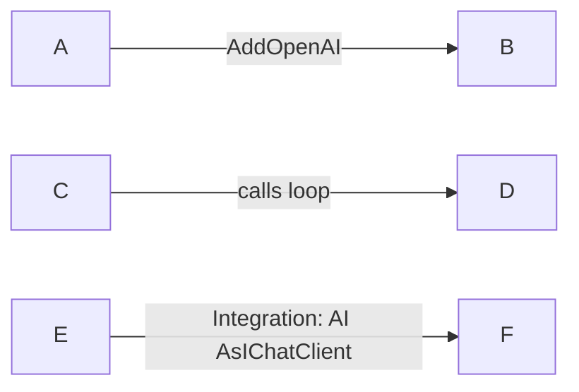
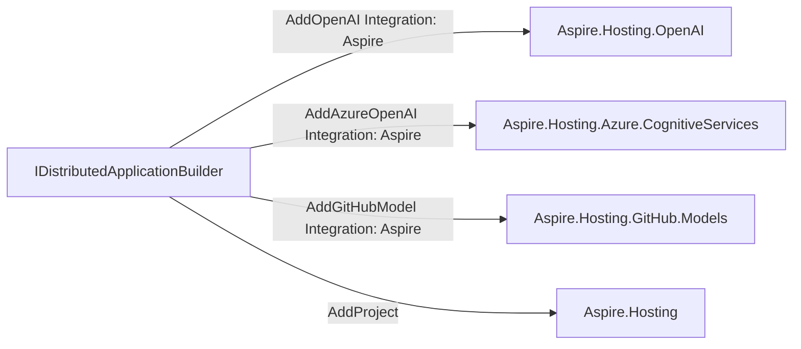
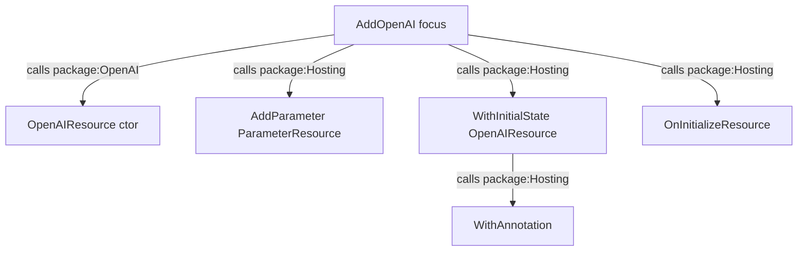
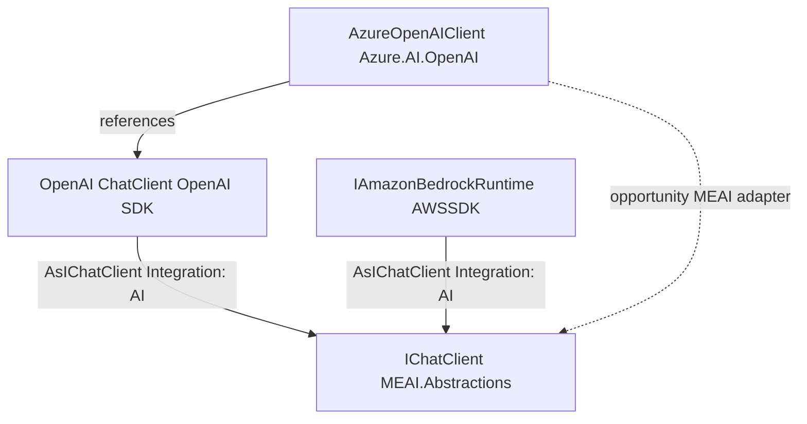
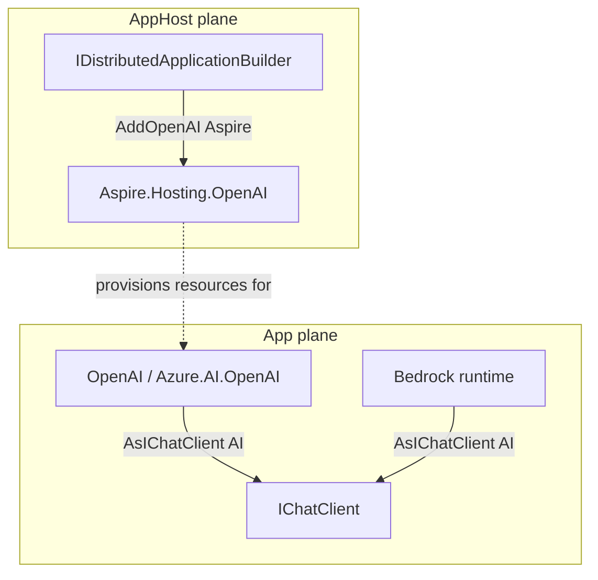
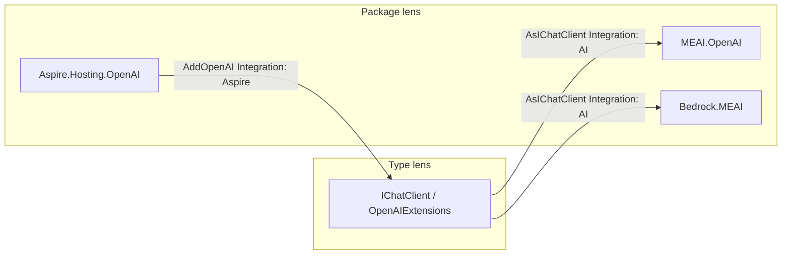

# Aspire + AI graphs (target demos)

> **These are demos we want**, not a claim that every step is product-complete
> today. Each scenario states what works now vs what is blocked. Tracking
> issues own the gaps; this file owns the experience we are aiming at.
>
> Framing: useful patterns equal tool flex. Graphs should answer composition
> questions with **readable arcs**, not only dense member stars.

## Pins (when exercising live slices)

| Role | Package | Version |
| ---- | ------- | ------- |
| Hosting hub | `Aspire.Hosting` | 13.4.6 |
| OpenAI hosting | `Aspire.Hosting.OpenAI` | 13.4.6 |
| Azure OpenAI hosting | `Aspire.Hosting.Azure.CognitiveServices` | 13.4.6 |
| GitHub Models hosting | `Aspire.Hosting.GitHub.Models` | 13.4.6 |
| MEAI abstractions | `Microsoft.Extensions.AI.Abstractions` | 10.9.0 |
| MEAI | `Microsoft.Extensions.AI` | 10.9.0 |
| OpenAI to MEAI | `Microsoft.Extensions.AI.OpenAI` | 10.9.0 |
| OpenAI SDK | `OpenAI` | 2.12.0 |
| Azure OpenAI SDK | `Azure.AI.OpenAI` | 2.1.0 |
| Bedrock to MEAI | `AWSSDK.Extensions.Bedrock.MEAI` | 4.0.101.8 |

## Arc annotations (design intent)

Graphs are only compelling when **edges carry meaning**. Target annotation
layers (orthogonal; progressive disclosure picks which render):

| Layer | Example arc label | Applies to |
| ----- | ----------------- | ---------- |
| Relationship kind | `extends`, `calls`, `implements`, `references` | All graph modes |
| API / member | `AddOpenAI`, `AsIChatClient` | Package web, call graph |
| Integration category | `Integration: Aspire`, `Integration: AI` | Package and integration webs |
| Call facts | `loop`, `virtual`, `external-resolved` | Call graph (partially today) |
| Boundary | `package: Aspire.Hosting` / group id | Multi-package graphs |

### Mermaid support

**Yes.** Flowchart edges take labels:



Forms: `A -->|label| B` and `A -- label --> B`. GitHub PR Markdown renders
label text on the arc. Optional `linkStyle` is chrome; **label text is the
contract**.

### Product today vs target

| Concern | Today | Target |
| ------- | ----- | ------ |
| Call-graph edge label | Mostly loop (`GraphEdge.Label = LoopLabel`); member names on nodes | Selectable edge fields: kind, loop, integration, package boundary |
| Package / extensions web | Table of methods (no graph sink) | Graph: hub type to package; arc = method + integration |
| Multi-input ad hoc graph | Seed-centric only (see #4133) | Ad hoc mode unions inputs; arcs keep provenance |
| Node signals (`--fields`) | Alloc/throw on nodes | Keep; do not force all facts onto arcs |

Tracking issues are listed in [Gap index](#gap-index).

## Demo A — Aspire hosting package web

**Question:** How do AI hosting packages hang off the AppHost builder?

### A — Target experience

```text
dotnet-inspect graph extensions IDistributedApplicationBuilder \
  --package Aspire.Hosting@13.4.6 \
  --package Aspire.Hosting.OpenAI@13.4.6 \
  --package Aspire.Hosting.Azure.CognitiveServices@13.4.6 \
  --package Aspire.Hosting.GitHub.Models@13.4.6 \
  --tfm net8.0 \
  --mermaid
```



### A — Works now (partial)

```bash
dotnet-inspect extensions IDistributedApplicationBuilder \
  --package Aspire.Hosting@13.4.6 \
  --package Aspire.Hosting.OpenAI@13.4.6 \
  --package Aspire.Hosting.Azure.CognitiveServices@13.4.6 \
  --package Aspire.Hosting.GitHub.Models@13.4.6 \
  --tfm net8.0 -v:n
```

```bash
dotnet-inspect library Aspire.Hosting.OpenAI@13.4.6 -S "Integration: Aspire" -v:n
```

Table plus per-library integration census. No graph sink; no integration on
arcs (integrations are a separate section).

**Blocked on:** package-web graph projection; arc annotation model; optional
command shape (`graph` / `extensions --mermaid`).

## Demo B — Seed call graph into the hosting hub

**Question:** What does `AddOpenAI` do inside Aspire once the hub is in scope?

### B — Target experience

```text
dotnet-inspect member OpenAIExtensions AddOpenAI \
  --package Aspire.Hosting.OpenAI@13.4.6 \
  --caller-package Aspire.Hosting@13.4.6 \
  -S "Call Graph" --mermaid \
  --edge-fields kind,package
```



### B — Works now (partial)

```bash
dotnet-inspect member OpenAIExtensions AddOpenAI \
  --package Aspire.Hosting.OpenAI@13.4.6 \
  --caller-package Aspire.Hosting@13.4.6 \
  -S "Call Graph" --markdown --mermaid -v:n
```

Seed-centric call graph with Hosting resolution; groups appear in node text /
`from_group`. Edge labels are not rich package or integration annotations.

**Blocked on:** richer arc annotations; #3632 for deeper external
resolution. Does **not** reach MEAI, Azure.AI.OpenAI, or Bedrock (no refs from
the hosting package).

## Demo C — Multi-provider AI client graph (MEAI hub)

**Question:** How do OpenAI, Azure OpenAI, and Bedrock meet at `IChatClient`?

This is the compelling **cross-ecosystem** story. It is **not** `AddOpenAI`
widened with client packages — hosting does not call them.

### C — Target experience (ad hoc / multi-seed)

```text
dotnet-inspect callgraph \
  --package Microsoft.Extensions.AI.Abstractions@10.9.0 \
  --package Microsoft.Extensions.AI.OpenAI@10.9.0 \
  --package OpenAI@2.12.0 \
  --package Azure.AI.OpenAI@2.1.0 \
  --package AWSSDK.Extensions.Bedrock.MEAI@4.0.101.8 \
  --seed OpenAIClientExtensions.AsIChatClient \
  --seed AmazonBedrockRuntimeExtensions.AsIChatClient \
  --focus-type Microsoft.Extensions.AI.IChatClient \
  --mermaid
```



### C — Works now (partial, seed-centric only)

```bash
dotnet-inspect library Microsoft.Extensions.AI.OpenAI@10.9.0 -S "Integration: AI" -v:n
```

```bash
dotnet-inspect library AWSSDK.Extensions.Bedrock.MEAI@4.0.101.8 -S "Integration: AI" -v:n
```

```bash
dotnet-inspect member OpenAIClientExtensions AsIChatClient:3 \
  --package Microsoft.Extensions.AI.OpenAI@10.9.0 \
  --caller-package Microsoft.Extensions.AI.Abstractions@10.9.0 \
  --caller-package OpenAI@2.12.0 \
  -S "Call Graph" -v:n
```

```bash
dotnet-inspect member AmazonBedrockRuntimeExtensions AsIChatClient:1 \
  --package AWSSDK.Extensions.Bedrock.MEAI@4.0.101.8 \
  --caller-package Microsoft.Extensions.AI.Abstractions@10.9.0 \
  -S "Call Graph" -v:n
```

Each adapter is a separate seed graph into MEAI.Abstractions or the provider
SDK. No single multi-seed diagram. Azure shows Integration Opportunities toward
MEAI rather than a hard `AsIChatClient` edge in-package.

**Blocked on:** #4133 ad hoc multi-input mode; arc annotations
(integration on edges); optional touchpoints (#3630) for reference-only
Azure to OpenAI edges; #3632 where bodies cross packages.

## Demo D — Two-plane story (hosting provision and client consume)

**Question:** End-to-end narrative in one shareable view.



**Works now:** tell the story with Demo A/B partial plus Demo C partial as
separate commands.

**Blocked on:** workspace scenario composition, ad hoc graph, annotated arcs.
Dashed "provisions for" is narrative unless modeled as a first-class
relationship type.

## Gap index

| Gap | Demo | Tracking |
| --- | ---- | -------- |
| Seed vs ad hoc call-graph modes | C, D | #4133 |
| Transitive cross-library body resolution | B, C | #3632 |
| Package-web / extensions as graph sink | A | #4139 (envelope) + package-web producer |
| Graph arc annotation model | A-D | #4139 |
| Workspace integrations roll-up | A, C | #3629 |
| Reference touchpoints (non-call edges) | C | #3630 |
| Declarative scenario / wasm multi-package share | D | workspace-definitions / wasm |

Issue numbers above are GitHub issues (4133, 3632, 3629, 3630); link them in
the PR body when filing the two new trackers.

## Thesis — type and package at once

Call-graph demos are most powerful when **type and package are simultaneous
lenses on one member-centric graph**, not two separate tools:

| Direction | Start | Travel | Land |
| --------- | ----- | ------ | ---- |
| Type outward | A type (or its members) | Call edges + characteristics | Packages, integrations, providers |
| Package inward | A package set | Call / extends / integration arcs | Types and APIs that matter |

**Arcs are to the graph what carets are to AnnotatedSourceDocument:** the
visual hook that carries the rest of the tool’s richness (integration kind,
package boundary, loop, alloc, findings) without changing the underlying
identity. Members stay the substrate (#4139); arcs and node marks are the
descriptive plane; viewers filter layers.

Same envelope both ways — seed or ad hoc mode (#4133) only changes how the
subgraph is chosen, not whether type and package can co-appear.



Demo A/C lean package→type; Demo B leans type/member→package. Ideal shareable
views show **both** group labels and typed arcs in one diagram.

## Validation posture

- **Target Mermaid** in this file is normative for product direction; it is not
  an expect block until the command exists.
- **Works now** commands may gain expect blocks in follow-ups once stabilized.
- Do not weaken product call-graph contracts to fake multi-provider edges from
  `AddOpenAI`; wrong seed is a demo bug.
